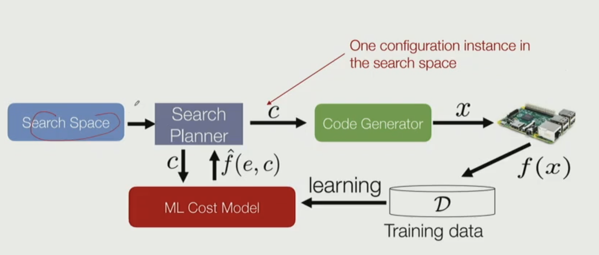

# CSE 234

> https://hao-ai-lab.github.io/cse234-w25/

## Lecture 3

- How to make operators fast
  - Vectorize
  - Data layout
  - Parallelization

- Strides format

```py
A[i0][i1][i2] = A_internal[
  stride_offset
  + i0 * A_strides[0]
  + i1 * A_strides[1]
  + i2 * A_strides[2]
]
```

## Lecture 4

- Why bother store strides?
  - zero-copy - Tensor `view`, `slice`, `transpose`, `boardcast`

- Problem of strides
  - May become not continuous
  - Many operations requires continuous storage


max AI = #ops / #bytes

- MatMul tiling

  

- Moore's Law comes to an end
  - Option 1: Quantum computing
  - Option 2: Specialized hardware
    - GPU
    - TPU
    - B200: fp4 / fp8 tensor core
    - M3: mixing tensor core and normal core

- Sparse
- Quantomizaion - reduce precision


- Apple: 
- Leading startups:
  - Groq

## Lecture 5

- MatMul [m,n]x[n,p], Flops = 2mnp

- Threads, Blocks, Grids, Kernel
- Control flow masking (bubbles)

## Lecture 6

- Kernel tuning
  - Many operators, many devices
  - Manually / compiler

- Compiler
  - Automatically generate optimal configurations and code given users ML code on target hardware

  - Model -> Dataflow graph -> Efficient kernel code -> Machine code
  - How to represent all possibilities (search space)
  - How to search for the optimal one

    Search via learned cost model
    

    - issue: still need experts to write templates


- Notable Compilers:
  - XLA: First compiler for ML, with TensorFlow
  - TVM: For inference
  - Torch 2
  - Modular: By inventor of LLVM

- Triton: simpler than CUDA, more expressive than graph compilers

> WIP