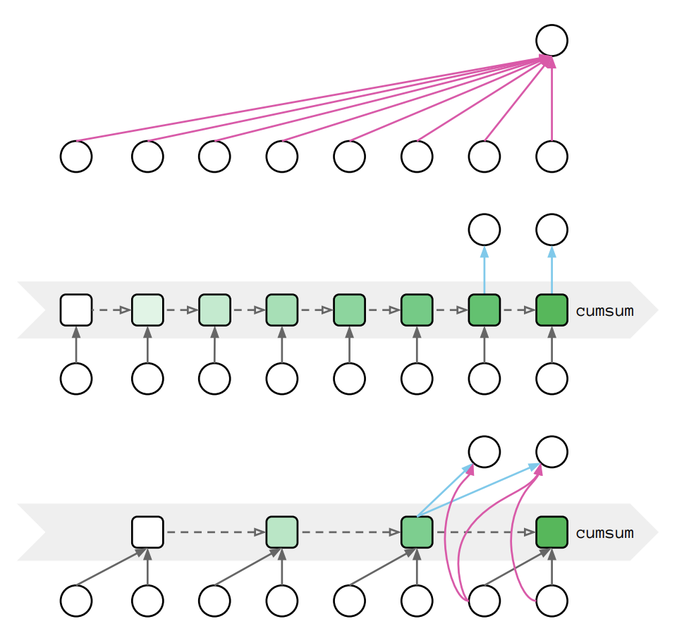
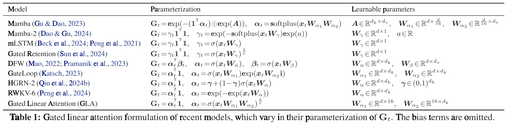
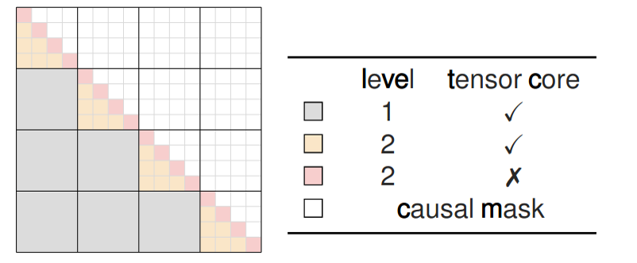

# Linear Attention

## Original Linear Attention

The original attention mechanism is defined as:

<blockquote class="float-right !mt-2 w-60">

Complexity: $\mathcal O(N^2 d_k + N^2 d_v)$

</blockquote>

$$
O = \operatorname{softmax}(QK^\top)V
$$

If we omit the softmax operator it becomes:

<blockquote class="float-right !mt-2 w-60">

Complexity: $\mathcal O(N d_k d_v)$

</blockquote>

$$
O = QK^\top V = Q(K^\top V)
$$

which is of linear complexity.

## In Autoagressive Models

In autoregressive models like GPT we need a causal mask:

$$
\begin{aligned}
\text{Training:}\;&O = \operatorname{softmax}(QK^\top \odot M)V \\
\text{Inference:}\;&o_t = \sum_{j=1}^{t}\frac{\exp(q_t^\top k_j)}{\sum_{l=1}^{t}\exp(q_t^\top k_l)}v_j
\end{aligned}
$$

Removing softmax yields:

$$
\begin{aligned}
\text{Training:}\;&O = (QK^\top \odot M)V \\
\text{Inference:}\;&o_t = \sum_{j=1}^{t}(q_t^\top k_j)v_j
\end{aligned}
$$

Unfortunately the Hadamard product ($\odot$) does not commute with matrix multiplication, so the operation remains quadratic.

## RNN-like Sequential Form

Even though, [*Transformers are RNNs: Fast Autoregressive Transformers with Linear Attention*](https://arxiv.org/abs/2006.16236) observes that the inference equation can be written in an RNN-like form:

$$
o_t = \sum_{j=1}^{t}(v_j k_j^\top) q_t = S_t q_t, \qquad
S_t = S_{t-1} + v_t k_t^\top
$$

This achieves linear time, but introduces two drawbacks:

1. Memory during autograd:

   High memory footprint during autograd: every intermediate state $S_t$ must be stored, resulting in $\mathcal O(L d^2)$ memory usage. The authors alleviate this by recomputing $S_t$ on-the-fly during back-propagation.

2. Parallelism:

   Poor training parallelism: the update is element-wise instead of large matrix multiplications, which under-utilizes GPU tensor cores.

   A compromise is the chunkwise algorithm proposed in [*Transformer Quality in Linear Time*](https://arxiv.org/abs/2202.10447), which allows parallelism while remaining linear.

   > From up to bottom: Parallel form, recurrent form, chunkwise parallel form:
   > 

## Gated Linear Attention

A learnable 2D forget gate $G_t \in (0,1)^{d_k \times d_v}$ is added:

$$
S_t = G_t \odot S_{t-1} + k_t^\top v_t
$$

This is very general and encompasses many recent RNNs with 2D hidden states:

[*Gated Slot Attention for Efficient Linear-Time Sequence Modeling*](https://arxiv.org/abs/2409.07146) also proposed its GLA:

- Recurrent form:

$$
S_t = (\alpha _t^\top 1) \odot S_{t-1} + k_t^\top v_t = \operatorname{Diag}(\alpha _t)S_{t-1} + k_t^\top v_t
$$

- Parallel form:

$$
S_t = \sum_{i=1}^{t} \left( \left( \prod_{j=i+1}^{t} \alpha_j \right) \odot k_i^\top v_i \right)
$$

- Chunkwise parallel:

   

## References

- Sonta. "Zhihu answer" https://www.zhihu.com/question/9740764576/answer/80735153803
- Katharopoulos A., Vyas A., Pappas N., Fleuret F. "Transformers are RNNs: Fast Autoregressive Transformers with Linear Attention." https://arxiv.org/abs/2006.16236
- Vyas A., Katharopoulos A., Fleuret F. "Transformer Quality in Linear Time." https://arxiv.org/abs/2202.10447
- Li Y., Peng H., Chen X., et al. "Gated Slot Attention for Efficient Linear-Time Sequence Modeling." https://arxiv.org/abs/2409.07146
