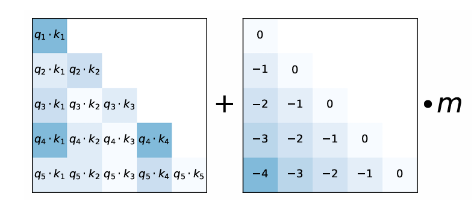

# Positional Encoding

## Sinusoidal

> [Attention is All You Need](https://arxiv.org/abs/1706.03762)

$$
\begin{aligned}
PE(pos, 2i) &= \sin(pos / 10000^{2i / d_\text{model}}) \\
PE(pos, 2i+1) &= \cos(pos / 10000^{2i / d_\text{model}})
\end{aligned}
$$

Then add it to the input vectors.

## NoPE

> [Length Generalization of Causal Transformers without Position Encoding](https://arxiv.org/abs/2404.12224)

No positional encoding.

## Additive

### ALiBi

> [Train Short, Test Long: Attention with Linear Biases Enables Input Length Extrapolation](https://arxiv.org/abs/2108.12409)

- Original attention score: $\operatorname{softmax}(\textbf{q}_i\textbf{K}^T)$
- With AliBi: $\operatorname{softmax}(\textbf{q}_i\textbf{K}^T + m \cdot \left[-(i-1),\dots,-2,-1,0\right])$
- $m$ is a const head-specific scalar: $2^{\frac{-8}{n}}$ for the $n$th head.
- No positional encoding.

### T5's RPE

> [Exploring the Limits of Transfer Learning with a Unified Text-to-Text Transformer](https://arxiv.org/abs/1910.10683)

$$
\textbf B_{i,j} = r_{\operatorname{min}(i-j, K)}
$$

- $K$ is hyper-parameter.
- $r_i$ are learnable scalars.

### Kerpel

> [KERPLE: Kernelized Relative Positional Embedding for Length Extrapolation](https://arxiv.org/abs/2205.09921)

$$
\textbf B_{i,j} = -r_1 \operatorname{log}(1+r_2 | i-j |)
$$

### Sandwich

> [Dissecting Transformer Length Extrapolation via the Lens of Receptive Field Analysis](https://arxiv.org/abs/2212.10356)

$$
\textbf B_{i,j} = r_1 \sum_{k=1}^{r_2} \operatorname{cos}(\frac{i-j}{10000^{k/d'}})
$$

### FIRE

> [Functional Interpolation for Relative Positions Improves Long Context Transformers](https://arxiv.org/abs/2310.04418)

$\textbf B_{i,j} = f_\theta\left(\frac{\psi(i − j)}{\psi(\operatorname{max}\left\{L, i\right\})}\right)$

   - $f_\theta: \mathbb R \to \mathbb R$ is MLP.
   - $\phi: \mathbb N \to \mathbb R_+$ is monotonically increasing (e.g. $\phi(x) = \operatorname{log}(cx+1)$).
   - $L > 0$ is a learnable scalar.

### CaPE

> [CAPE: Context-Adaptive Positional Encoding for Length Extrapolation](https://arxiv.org/abs/2405.14722v1)

- $\textbf A_\text{CAPE}(\textbf X) = \textbf X \textbf W_Q(\textbf X \textbf W_K)^\top + f(\textbf X \textbf W_Q(\textbf X \textbf W_K)^\top, \textbf B)$
- $f$ is a two-layer LeakyReLU neural network.
- $\mathbf B$ is positional bias matrices (e.g. ALiBi and FIRE).

### FoX

> [Forgetting Transformer: Softmax Attention with a Forget Gate](https://arxiv.org/abs/2503.02130)

- Dynamic down-weighting of past information.
- No need of position embeddings.
- Compatible with FlashAttention.

1. Scalar Forget Gate

   $$
   f_t=\sigma\left(w_f^{\top} x_t+b_f\right)
   $$

   Where $w_f$ and $b_f$ are learnable and per-head (for multiple head attention).

2. Cumulative Forget Factor

   $$
   \begin{aligned}
   &F_{i j}=\prod_{l=j+1}^i f_l \space(1 \text{ if } i=j)\\
   &B_{i j}=\log F_{i j}=\sum_{l=j+1}^i \log f_l
   \end{aligned}
   $$
<!-- 
3. Forgetting Attention Output

   - A modified version of Softmax: The forget factor $D_{i j}$ is added to logits.

   $$
   o_i=\frac{\sum_{j=1}^i F_{i j} \exp \left(q_i^{\top} k_j\right) v_j}{\sum_{j=1}^i F_{i j} \exp \left(q_i^{\top} k_j\right)}=\frac{\sum_{j=1}^i \exp \left(q_i^{\top} k_j+D_{i j}\right) v_j}{\sum_{j=1}^i \exp \left(q_i^{\top} k_j+D_{i j}\right)}
   $$

   _Matrix Form_:

   $$
   O=\operatorname{softmax}\left(Q K^{\top}+D\right) V \in \mathbb{R}^{L \times d}
   $$ -->

#### FoX (Pro)

### CoPE

> [Contextual Position Encoding: Learning to Count What's Important](https://arxiv.org/abs/2405.18719)

- Dynamically decide which tokens should be counted based on the context.
- More flexible position addressing (e.g. i-th specific word, noun, or sentence).

1. Gate Computation

   $$
   g_{i j}=\sigma\left(q_i^T k_j\right)
   $$

2. Contextual Position Calculation

   $$
   p_{i j}=\sum_{k=j}^i g_{i k}
   $$

3. Position Embedding Interpolation

   - Because $p_{i j}$ may be a fraction, interpolation is used to compute the embedding vector.
   - For each integer position, a learnable embedding vector $e[p]$ is used.
   - For decimal position: $e\left[p_{i j}\right]=\left(p_{i j}-\left\lfloor p_{i j}\right\rfloor\right) e\left[\left[p_{i j}\right]\right]+\left(1-p_{i j}+\left\lfloor p_{i j}\right\rfloor\right) e\left[\left\lfloor p_{i j}\right\rfloor\right]$

4. Attention Calculation

   _Raw_:

   - $a_{i j}=\operatorname{Softmax}\left(q_i^T k_j+q_i^T e\left[p_{i j}\right]\right)$

   _Optimized_: (Interacts with the query vector before interpolation)

   - Pre-computed for all integer positions: $z_i[p]=q_i^T e[p]$
   - Interpolating scalar attention contribution: $z_i\left[p_{i j}\right]=\left(p_{i j}-\left\lfloor p_{i j}\right\rfloor\right) z_i\left[\left\lceil p_{i j}\right\rceil\right]+\left(1-p_{i j}+\left\lfloor p_{i j}\right\rfloor\right) z_i\left[\left\lfloor p_{i j}\right\rfloor\right]$
   - $a_{i j}=\operatorname{Softmax}\left(q_i^T k_j+z_i\left[p_{i j}\right]\right)$

## SBA

> [Scaling Stick-Breaking Attention: An Efficient Implementation and In-depth Study](https://arxiv.org/abs/2410.17980)

- Using the stick-breaking process as a replacement for softmax for attention.
- Naturally incorporating recency bias.
- No need of positional encoding.

1. Original Logits

   $$
   z_{i j} = \frac{q_j^T k_i}{\sqrt{d_\text{head}}}
   $$

2. Breakpoint Possibility

   $$
   \beta_{i j} = \sigma(z_{i j})
   $$

3. Attention Weights

   - From $j$ to $i$ (backwards in time).

   $$
   A_{i,j}=\beta_{i,j}\prod_{i<k<j}(1-\beta_{k,j})
   $$

4. Output

   $$
   o_{j}=\sum_{i=1}^{j-1}A_{i,j}v_{i}
   $$

- Numerically Stable Implementation

   By Log-Space Formulation.

   1. Sigmoid in log-space:

      $log~\beta_{i,j} = log~\sigma(z_{i,j}) = z_{i,j}-log(1+exp(z_{i,j}))$

      $log(1-\beta_{k,j}) = log(1-\sigma(z_{k,j})) = -log(1+exp(z_{k,j}))$

      Where $log(1+exp(x))$ is commonly known as softplus(x).

   2. Compute $A_{i,j}$ in log-space:

      $A_{i,j} = exp(log~\beta_{i,j}+\sum_{k=i+1}^{j-1}log(1-\beta_{k,j}))$

      $A_{i,j} = exp(z_{i,j}-log(1+exp(z_{i,j}))-\sum_{k=i+1}^{j-1}log(1+exp(z_{k,j})))$

      $A_{i,j} = exp(z_{i,j}-\sum_{k=i}^{j-1}log(1+exp(z_{k,j})))$

   3. Stabilized softplus:
      $\operatorname{softplus}(x)=\begin{cases}log(1+exp(x)) & \text{if } x\le15 \\ x & \text{otherwise}\end{cases}$

## Rotary

### RoPE

> [Roformer: Enhanced transformer with rotary position embedding](https://arxiv.org/abs/2104.09864)

$$
\begin{equation}\scriptsize{\underbrace{\begin{pmatrix} \cos m\theta_1 & -\sin m\theta_1 & 0 & 0 & \cdots & 0 & 0 \\ \sin m\theta_1 & \cos m\theta_1 & 0 & 0 & \cdots & 0 & 0 \\ 0 & 0 & \cos m\theta_2 & -\sin m\theta_2 & \cdots & 0 & 0 \\ 0 & 0 & \sin m\theta_2 & \cos m\theta_2 & \cdots & 0 & 0 \\ \vdots & \vdots & \vdots & \vdots & \ddots & \vdots & \vdots \\ 0 & 0 & 0 & 0 & \cdots & \cos m\theta_{d/2} & -\sin m\theta_{d/2} \\ 0 & 0 & 0 & 0 & \cdots & \sin m\theta_{d/2} & \cos m\theta_{d/2} \\ \end{pmatrix}}_{\boldsymbol{W}_m} \begin{pmatrix}q_0 \\ q_1 \\ q_2 \\ q_3 \\ \vdots \\ q_{d-2} \\ q_{d-1}\end{pmatrix}}\end{equation}
$$

where $\theta_i = 10000^{-2(i-1)/d}$

It works because $(\boldsymbol{W}_m \boldsymbol{q})^{\top}(\boldsymbol{W}_n \boldsymbol{k}) =  \boldsymbol{q}^{\top} \boldsymbol{W}_m^{\top}\boldsymbol{W}_n \boldsymbol{k} = \boldsymbol{q}^{\top} \boldsymbol{W}_{n-m} \boldsymbol{k}$

### 2D-RoPE

> [Rotary Position Embedding for Vision Transformer](https://arxiv.org/abs/2403.13298v1)

$$
\mathbf{R}(n, 2t)=e^{i \theta _t x_n}, 
\mathbf{R}(n, 2t + 1)=e^{i \theta _t y_n}
$$

$$
\theta _t = 100^{-t / (d_\text{head} / 4)}, \text{where}\space t \in \left\{ 0, 1, \dots, d_\text{head} / 4 \right\}
$$

### LieRE

> [LieRE: Lie Rotational Positional Encodings](https://arxiv.org/abs/2406.10322)

- For high dimension ($n$).

- Learn skew-symmetric basis of matrices $\left\{\mathbf A_i\right\}$ 

  > Skew-symmetric: $\mathbf A_i^\top = -\mathbf A$

- For position $p$, encode as $p = \sum_{i=0}^n p_i \mathbf A_i$

- $\mathbf R(p) = \operatorname{exp}(\sum_{i=0}^n p_i \mathbf A_i)$

- $Q_i' = \mathbf R(p_i) Q_i$, $K_i' = \mathbf R(p_i) K_i$

### ComRoPE

> [ComRoPE: Scalable and Robust Rotary Position Embedding Parameterized by Trainable Commuting Angle Matrices](http://arxiv.org/abs/2506.03737)

- $f$ is a _Relative Positional Encoding_ if and only if there is a $g$ satisfies:

   $$
   g(q, k, x − y) = \rho(f (q, x), f (k, y))
   $$

   where $\rho$ is a similarity function

- In this form, RoPE can be represented as:

   $$
   \left\{\,
   \begin{array}{l}
   f(q, x)=\mathbf{R}_{f}(x) q \\
   \rho(q, k)=q^{\top} k \\
   g(q, k, x-y)=q^{\top} \mathbf{R}_{f}(y-x) k
   \end{array}
   \right.
   $$

   which also satisfies:

   $$
   \mathbf{R}_{f}(x)^\top \mathbf{R}_{f} (y) = \mathbf{R}_{f} (y − x)
   $$

- $\mathbf{R}$ is a _rotation matrix function_ if

   $$
   \mathbf{R}(x; \left\{\mathbf A_1, \mathbf A_2, \dots \right\}) = \operatorname{exp}(\sum_{i=1}^{N} \mathbf{A}_i x_i), \qquad
   \text{where}\space \operatorname{exp}(\mathbf{X}) = \sum_{k=0}^\infty \frac{\mathbf{X}^k}{k!}
   $$

   THEOREM: 
   $$
   \mathbf{R}_{f}(x)^\top \mathbf{R}_{f} (y) = \mathbf{R}_{f} (y − x)
   $$

   $$
   \qquad\iff
   \forall i, j, \, \mathbf A_i \mathbf A_j = \mathbf A_j \mathbf A_i
   $$

   Let $\mathbf A_i = \operatorname{diag}(\mathbf B_{i1}, \mathbf B_{i2}, \dots, \mathbf B_{im})$

   $$
   \qquad\iff
   \forall i, j, k \,\, \mathbf B_{ik} \mathbf B_{jk} = \mathbf B_{jk} \mathbf B_{ik}
   $$

- Then we need to find $\mathbf B$ that satisfies above.

   - _ComRoPE-AngleMatrices_:

      $$
      \mathbf B_{ij} = \begin{cases}
         \mathbf{P}_j - \mathbf{P}_j^\top, & \text{if } j \equiv i \pmod N \\
         \mathbf{O}, & \text{otherwise}
      \end{cases}
      $$

      where $\mathbf{P}_j$ is trainable
   
   - _ComRoPE-LinearlyDependent_:

      $$
      \lambda _1 \mathbf B_1 = \lambda _2 \mathbf B_2 = \dots = \lambda _N \mathbf B_N
      $$

      Specially,

      $$
      \mathbf B_i = \theta_i \left(\mathbf P - \mathbf P^\top \right)
      $$

| Method | Commutativity | Extra Parameters | Extra Time Complexity |
| :------------------------- | :------------ | :--------------- | :-------------------- |
| APE                        | —             | $nd$             | $O(nd)$               |
| Vanilla RoPE               | Yes           | 0                | $O(Lnd(bN + b^2 + \frac{d}{h})) \approx O(\frac{Lnd^2}{h})$ |
| LieRE                      | Commonly Not  | $LNdb$  | $O(Lnd(bN + b^2 + \frac{d}{h}))$ |
| ComRoPE-AP          | Yes           | $Ldb$   | $O(Lnd(bN + b^2 + \frac{d}{h}))$ |
| ComRoPE-LD          | Yes           | $Ld(b + \frac{N}{b})$ | $O(Lnd(bN + b^2 + \frac{d}{h}))$ |

### FoPE

> [Fourier Position Embedding: Enhancing Attention's Periodic Extension for Length Generalization](https://arxiv.org/abs/2412.17739)

## TaPE

> conTextualized equivariAnt Position Embedding
> 
> [Rethinking Addressing in Language Models via Contexualized Equivariant Positional Encoding](https://arxiv.org/abs/2501.00712)

- Permutation Equivariance
