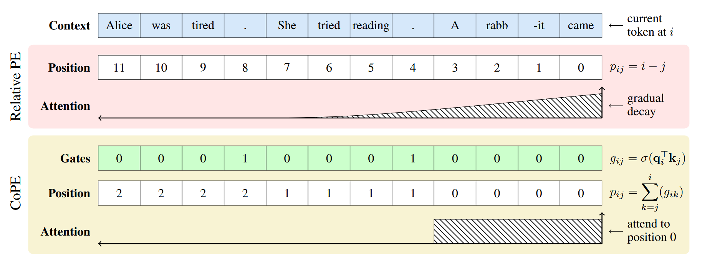
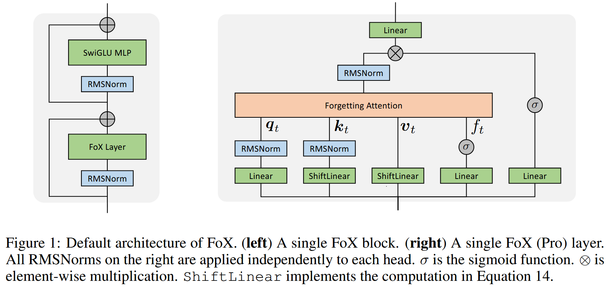

# Positional Encoding

## Sinusoidal

> [Attention is All You Need](https://arxiv.org/abs/1706.03762)

$$
\begin{aligned}
PE(pos, 2i) &= \sin(pos / 10000^{2i / d_\text{model}}) \\
PE(pos, 2i+1) &= \cos(pos / 10000^{2i / d_\text{model}})
\end{aligned}
$$

Then add it to the input vectors.

## RoPE

> [Roformer: Enhanced transformer with rotary position embedding](https://arxiv.org/abs/2104.09864)

$$
\begin{equation}\scriptsize{\underbrace{\begin{pmatrix} \cos m\theta_0 & -\sin m\theta_0 & 0 & 0 & \cdots & 0 & 0 \\ \sin m\theta_0 & \cos m\theta_0 & 0 & 0 & \cdots & 0 & 0 \\ 0 & 0 & \cos m\theta_1 & -\sin m\theta_1 & \cdots & 0 & 0 \\ 0 & 0 & \sin m\theta_1 & \cos m\theta_1 & \cdots & 0 & 0 \\ \vdots & \vdots & \vdots & \vdots & \ddots & \vdots & \vdots \\ 0 & 0 & 0 & 0 & \cdots & \cos m\theta_{d/2-1} & -\sin m\theta_{d/2-1} \\ 0 & 0 & 0 & 0 & \cdots & \sin m\theta_{d/2-1} & \cos m\theta_{d/2-1} \\ \end{pmatrix}}_{\boldsymbol{W}_m} \begin{pmatrix}q_0 \\ q_1 \\ q_2 \\ q_3 \\ \vdots \\ q_{d-2} \\ q_{d-1}\end{pmatrix}}\end{equation}
$$

where $\theta_i = 10000^{-2(i-1)/d}$

It works because $(\boldsymbol{W}_m \boldsymbol{q})^{\top}(\boldsymbol{W}_n \boldsymbol{k}) =  \boldsymbol{q}^{\top} \boldsymbol{W}_m^{\top}\boldsymbol{W}_n \boldsymbol{k} = \boldsymbol{q}^{\top} \boldsymbol{W}_{n-m} \boldsymbol{k}$

## ALiBi

> [Train Short, Test Long: Attention with Linear Biases Enables Input Length Extrapolation](https://arxiv.org/abs/2108.12409)

- Original attention score: $\operatorname{softmax}(\textbf{q}_i\textbf{K}^T)$
- With AliBi: $\operatorname{softmax}(\textbf{q}_i\textbf{K}^T + m \cdot \left[-(i-1),\dots,-2,-1,0\right])$
- $m$ is a const head-specific scalar: $2^{\frac{-8}{n}}$ for the $n$th head.
- No positional encoding.

## CoPE

> [Contextual Position Encoding: Learning to Count What's Important](https://arxiv.org/abs/2405.18719)

- Dynamically decide which tokens should be counted based on the context.
- More flexible position addressing (e.g. i-th specific word, noun, or sentence).

### 1. Gate Computation

$$
g_{i j}=\sigma\left(q_i^T k_j\right)
$$

### 2. Contextual Position Calculation

$$
p_{i j}=\sum_{k=j}^i g_{i k}
$$

### 3. Position Embedding Interpolation

- Because $p_{i j}$ may be a fraction, interpolation is used to compute the embedding vector.
- For each integer position, a learnable embedding vector $e[p]$ is used.
- For decimal position: $e\left[p_{i j}\right]=\left(p_{i j}-\left\lfloor p_{i j}\right\rfloor\right) e\left[\left[p_{i j}\right]\right]+\left(1-p_{i j}+\left\lfloor p_{i j}\right\rfloor\right) e\left[\left\lfloor p_{i j}\right\rfloor\right]$

### 4. Attention Calculation

_Raw_:

- $a_{i j}=\operatorname{Softmax}\left(q_i^T k_j+q_i^T e\left[p_{i j}\right]\right)$

_Optimized_: (Interacts with the query vector before interpolation)

- Pre-computed for all integer positions: $z_i[p]=q_i^T e[p]$
- Interpolating scalar attention contribution: $z_i\left[p_{i j}\right]=\left(p_{i j}-\left\lfloor p_{i j}\right\rfloor\right) z_i\left[\left\lceil p_{i j}\right\rceil\right]+\left(1-p_{i j}+\left\lfloor p_{i j}\right\rfloor\right) z_i\left[\left\lfloor p_{i j}\right\rfloor\right]$
- $a_{i j}=\operatorname{Softmax}\left(q_i^T k_j+z_i\left[p_{i j}\right]\right)$

## FoX

> [Forgetting Transformer: Softmax Attention with a Forget Gate](https://arxiv.org/abs/2503.02130)

- Dynamic down-weighting of past information.
- No need of position embeddings.
- Compatible with FlashAttention.

### 1. Scalar Forget Gate

$$
f_t=\sigma\left(w_f^{\top} x_t+b_f\right)
$$

Where $w_f$ and $b_f$ are learnable and per-head (for multiple head attention).

### 2. Cumulative Forget Factor

$$
\begin{aligned}
&F_{i j}=\prod_{l=j+1}^i f_l \space(1 \text{ if } i=j)\\
&D_{i j}=\log F_{i j}=\sum_{l=j+1}^i \log f_l
\end{aligned}
$$

### 3. Forgetting Attention Output

- A modified version of Softmax: The forget factor $D_{i j}$ is added to logits.

$$
o_i=\frac{\sum_{j=1}^i F_{i j} \exp \left(q_i^{\top} k_j\right) v_j}{\sum_{j=1}^i F_{i j} \exp \left(q_i^{\top} k_j\right)}=\frac{\sum_{j=1}^i \exp \left(q_i^{\top} k_j+D_{i j}\right) v_j}{\sum_{j=1}^i \exp \left(q_i^{\top} k_j+D_{i j}\right)}
$$

_Matrix Form_:

$$
O=\operatorname{softmax}\left(Q K^{\top}+D\right) V \in \mathbb{R}^{L \times d}
$$

### FoX (Pro)

## SBA

> [Scaling Stick-Breaking Attention: An Efficient Implementation and In-depth Study](https://arxiv.org/abs/2410.17980)

- Using the stick-breaking process as a replacement for softmax for attention.
- Naturally incorporating recency bias.
- No need of positional encoding.

### 1. Original Logits

$$
z_{i j} = \frac{q_j^T k_i}{\sqrt{d_\text{head}}}
$$

### 2. Breakpoint Possibility

$$
\beta_{i j} = \sigma(z_{i j})
$$

### 3. Attention Weights

- From $j$ to $i$ (backwards in time).

$$
A_{i,j}=\beta_{i,j}\prod_{i<k<j}(1-\beta_{k,j})
$$

### 4. Output

$$
o_{j}=\sum_{i=1}^{j-1}A_{i,j}v_{i}
$$

### Numerically Stable Implementation

By Log-Space Formulation.

1. Sigmoid in log-space:

   $log~\beta_{i,j} = log~\sigma(z_{i,j}) = z_{i,j}-log(1+exp(z_{i,j}))$

   $log(1-\beta_{k,j}) = log(1-\sigma(z_{k,j})) = -log(1+exp(z_{k,j}))$

   Where $log(1+exp(x))$ is commonly known as softplus(x).

2. Compute $A_{i,j}$ in log-space:

   $A_{i,j} = exp(log~\beta_{i,j}+\sum_{k=i+1}^{j-1}log(1-\beta_{k,j}))$

   $A_{i,j} = exp(z_{i,j}-log(1+exp(z_{i,j}))-\sum_{k=i+1}^{j-1}log(1+exp(z_{k,j})))$

   $A_{i,j} = exp(z_{i,j}-\sum_{k=i}^{j-1}log(1+exp(z_{k,j})))$

3. Stabilized softplus:
   $\operatorname{softplus}(x)=\begin{cases}log(1+exp(x)) & \text{if } x\le15 \\ x & \text{otherwise}\end{cases}$
