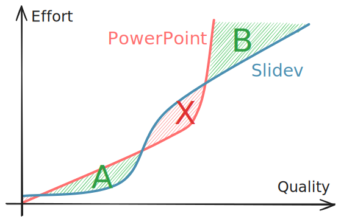

# Slidev 使用技巧 [<span text-sm ml-2>English</span>](./slidev-tips.md)

[Slidev](https://sli.dev) 是一款面向开发者的幻灯片工具。它帮助我高效地制作了许多高质量的幻灯片。我最喜欢它的这些特点：

- 文本驱动：VS Code、AI 补全、与长文互相改写
- 更熟悉的技术栈：Markdown、原子化 CSS ...
- 自带实用功能：主题、代码高亮 ...

本文是一些个人总结的经验，并不全面介绍所有功能，因此请您在学习 Slidev 的使用方式之后阅读。

## 0. 开始之前……

先想清楚制作这个幻灯片的目标：

<div pl-2>
<span class="text-#2f9e44 font-mono font-bold">A</span><span font-mono op-50 ml--1px>.</span> 尽快做完，质量不差就行<br>
<span class="text-#2f9e44 font-mono font-bold">B</span><span font-mono op-50 ml--1px>.</span> 追求效果，需要调整细节
</div>

Slidev 一方面有 Markdown 的直观 (<span class="text-#2f9e44 font-mono font-bold">A</span>)，另一方面有 Web 的无所不能 (<span class="text-#2f9e44 font-mono font-bold">B</span>)。但即使是对于专业开发者而言，它也并不总是优于 PowerPoint (<span class="text-#e03131 font-mono font-bold">X</span>)。

<div class="relative group of-hidden">


<!-- <div class="absolute top-50% bottom-0 w-60% ml-90% group-hover:ml-50% transition-all duration-500 bg-gray-200/60 backdrop-blur rounded-xl">
</div> -->
</div>

记住，无论你选择了哪一种目标，不要不小心滑进 <span class="text-#e03131 font-mono font-bold">X</span> 区域。

## 1. 原子化 CSS

Slidev 内置支持 [UnoCSS](https://unocss.dev) 和 [MDC](https://sli.dev/features/mdc)。

比如给部分文字上色：

```html
<!-- 纯 Markdown -->
This is <span style="color: blue">blue</span>.

<!-- 使用 UnoCSS -->
This is <span text-blue>blue</span>.

<!-- 同时使用 MDC 与 UnoCSS 
    （需要在 headmatter 中设置 `mdc: true`） -->
This is [blue]{.text-blue}.
```

这是 Slidev 编写幻灯片高效的重要原因之一，请千万记得使用它。

:::details <span text-lg>常用的原子类名</span>

<div font-mono>

- 布局：
  - flex flex-col grid grid-cols-2 items-center justify-center gap-4
  - relative absolute fixed m-4 p-4 w-4 h-4 left-4
- 排版：text-2xl font-bold font-mono italic underline
- 颜色：text-primary text-gray-800 bg-gray-200
- 透明度：op-80 bg-op-20
- 边框：&lt;div border="1 red solid rounded"&gt;

</div>

:::

## 2. 不要吝啬 HTML {#html}

很多时候我们自己设计和编写布局，这时的最佳办法是借助 HTML 的布局能力。不要害怕在 Markdown 里写 HTML。

以自我介绍页为例：

<SlideContainer>

<div my-24 mx-12 grid grid-cols-2>
<div flex flex-col items-center gap-4>
<div rounded-full class="w-46 h-46 bg-#ddd mb-4" />
<div class="w-42 h-12 bg-#ddd rounded-xl" />
<div class="w-42 h-6 bg-#ddd rounded-xl" />
</div>
<div flex flex-col gap-8>
<div class="w-64 h-22 bg-#ddd rounded-xl" />
<div class="w-80 h-22 bg-#ddd rounded-xl" />
<div class="w-72 h-22 bg-#ddd rounded-xl" />
</div>
</div>

</SlideContainer>

最高效的方式是直接在 Markdown 里写 HTML，利用 [`flex`](https://developer.mozilla.org/en-US/docs/Web/CSS/CSS_flexible_box_layout) / [`grid`](https://developer.mozilla.org/en-US/docs/Web/CSS/CSS_grid_layout) 布局：

```html
<div grid grid-cols-2>
<div flex flex-col items-center>
  
  <div mt-8>_Kerman</div>
</div>
<div>

- AAA
- BBB
- CCC

</div>
</div>
```

不用费心思挑选与微调模板，能省下不少时间精力。

## 3. 用透明度调色

尤其当你想要更有“层次感”的配色时，在给定的颜色中不一定能挑到最顺眼的颜色。透明度可以把颜色和背景按比例融合，得出你想要的颜色。

<div flex mx-2 font-mono gap-8 max-w-full>
<div flex flex-col justify-around text-base py-.5>
<div>&nbsp;</div>
<div>op-100&nbsp;&nbsp;&nbsp;</div>
<div op-60>op-60</div>
<div op-30>op-30</div>
</div>
<div flex-grow grid grid-cols-9 children:text-center py-.5>
<div col-span-9 text-base>text-green-*</div>
<div text-green-100>100</div>
<div text-green-200>200</div>
<div text-green-300>300</div>
<div text-green-400>400</div>
<div text-green-500>500</div>
<div text-green-600>600</div>
<div text-green-700>700</div>
<div text-green-800>800</div>
<div text-green-900>900</div>
<div text-green-100 op-60>100</div>
<div text-green-200 op-60>200</div>
<div text-green-300 op-60>300</div>
<div text-green-400 op-60>400</div>
<div text-green-500 op-60>500</div>
<div text-green-600 op-60>600</div>
<div text-green-700 op-60>700</div>
<div text-green-800 op-60>800</div>
<div text-green-900 op-60>900</div>
<div text-green-100 op-30>100</div>
<div text-green-200 op-30>200</div>
<div text-green-300 op-30>300</div>
<div text-green-400 op-30>400</div>
<div text-green-500 op-30>500</div>
<div text-green-600 op-30>600</div>
<div text-green-700 op-30>700</div>
<div text-green-800 op-30>800</div>
<div text-green-900 op-30>900</div>
</div>
</div>

<div flex mx-2 font-mono gap-8 max-w-full mt-2>
<div flex flex-col justify-around text-base py-.5>
<div>&nbsp;</div>
<div>bg-op-100</div>
<div op-60>bg-op-60</div>
<div op-30>bg-op-30</div>
</div>
<div flex-grow grid grid-cols-9 children:text-center py-.5>
<div col-span-9 text-base>bg-green-*</div>
<div text-gray-600 bg-green-100>100</div>
<div text-gray-600 bg-green-200>200</div>
<div text-gray-600 bg-green-300>300</div>
<div text-gray-600 bg-green-400>400</div>
<div text-gray-600 bg-green-500>500</div>
<div text-gray-600 bg-green-600>600</div>
<div text-gray-600 bg-green-700>700</div>
<div text-gray-600 bg-green-800>800</div>
<div text-gray-600 bg-green-900>900</div>
<div text-gray-600 bg-green-100 bg-op-60>100</div>
<div text-gray-600 bg-green-200 bg-op-60>200</div>
<div text-gray-600 bg-green-300 bg-op-60>300</div>
<div text-gray-600 bg-green-400 bg-op-60>400</div>
<div text-gray-600 bg-green-500 bg-op-60>500</div>
<div text-gray-600 bg-green-600 bg-op-60>600</div>
<div text-gray-600 bg-green-700 bg-op-60>700</div>
<div text-gray-600 bg-green-800 bg-op-60>800</div>
<div text-gray-600 bg-green-900 bg-op-60>900</div>
<div text-gray-600 bg-green-100 bg-op-30>100</div>
<div text-gray-600 bg-green-200 bg-op-30>200</div>
<div text-gray-600 bg-green-300 bg-op-30>300</div>
<div text-gray-600 bg-green-400 bg-op-30>400</div>
<div text-gray-600 bg-green-500 bg-op-30>500</div>
<div text-gray-600 bg-green-600 bg-op-30>600</div>
<div text-gray-600 bg-green-700 bg-op-30>700</div>
<div text-gray-600 bg-green-800 bg-op-30>800</div>
<div text-gray-600 bg-green-900 bg-op-30>900</div>
</div>
</div>

## 4. 用缩放调整空间

觉得页面太空或太挤？与其到处添加 `text-2xl` 来放大文本，不如直接缩放整张幻灯片。

全局调整可用 `canvasWidth` [headmatter 选项](https://sli.dev/custom/#headmatter)，默认 `980`。如果偏空，试试调小到 `784` 一类的值。

单独调整某几页幻灯片则可以使用 [`zoom` 选项](https://sli.dev/features/zoom-slide)。

## 5. 恰当使用 `v-drag`

[`v-drag`](https://sli.dev/features/draggable#draggable-elements) 让你像在 PowerPoint 一样，直接拖拽定位元素。

没有 `v-drag` 时，通常写 `<div absolute left-12 top-34>...</div>` 然后一点点改数值；现在只要写 `<div v-drag>...</div>`，在页面上拖到合适位置，坐标会自动回写到源码。

但别滥用它：对于能用 `flex`/`grid`（见[第 2 节](#html)）排版的元素，`v-drag` 定位更难维护。

## 6. 寻找灵感？

https://antfu.me/talks 收录了来自 Slidev 作者的演讲；幻灯片源码在这个 [GitHub 仓库](https://github.com/antfu/talks) 里可以找到。
