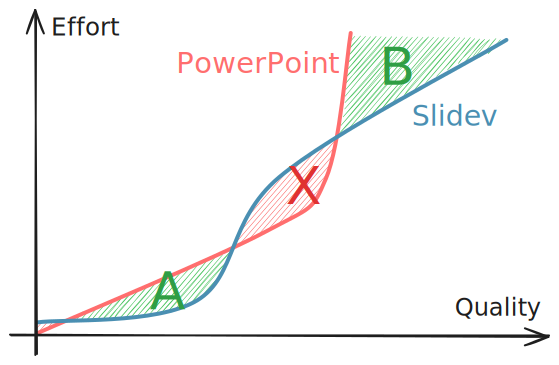

# Slidev Tips [<span text-sm ml-2>中文版</span>](./slidev-tips-zh.md)

[Slidev](https://sli.dev) is a wonderful tool for developers to create slides. It really helped me create high-quality slides efficiently.

I find these features the most appealing:

- Text-based content: VS Code, AI completion, rewriting to/from essays
- Familiar tech stack: Markdown, Atomic CSS, ...
- Useful built-in features: Themes, Code blocks, ...

I assume you've tried Slidev before reading this. This post is a set of opinionated tips and is supplemental.

## 0. Before starting your slides...

Ask yourself: what do you want?

<div pl-2>
<span class="text-#2f9e44 font-mono font-bold">A</span><span font-mono op-50 ml--1px>.</span> Finish the slides ASAP<br>
<span class="text-#2f9e44 font-mono font-bold">B</span><span font-mono op-50 ml--1px>.</span> Make the most attractive slides
</div>

Slidev wins for its Markdown-based intuitiveness (<span class="text-#2f9e44 font-mono font-bold">A</span>) and web-based customizability (<span class="text-#2f9e44 font-mono font-bold">B</span>). But it is not necessarily better than PowerPoint, even for developers (<span class="text-#e03131 font-mono font-bold">X</span>):

<div class="relative group of-hidden">


<!-- <div class="absolute top-50% bottom-0 w-60% ml-90% group-hover:ml-50% transition-all duration-500 bg-gray-200/60 backdrop-blur rounded-xl">
</div> -->
</div>

Keep this in mind and avoid slipping into the <span class="text-#e03131 font-mono font-bold">X</span> area.

## 1. Just use Atomic CSS

Slidev has built-in [UnoCSS](https://unocss.dev) and [MDC](https://sli.dev/features/mdc) support.

Let's see how to color part of the text:

```html
<!-- Plain Markdown -->
This is <span style="color: blue">blue</span>.

<!-- With UnoCSS -->
This is <span text-blue>blue</span>.

<!-- With MDC and UnoCSS 
    (requires `mdc: true` in headmatter) -->
This is [blue]{.text-blue}.
```

This is clearly a crucial reason for Slidev's efficiency. Use this as much as possible.

:::details <span text-lg>Must-know Atomic Class Names™</span>

<div font-mono>

- Layout:
  - flex flex-col grid grid-cols-2 items-center justify-center gap-4
  - relative absolute fixed m-4 p-4 w-4 h-4 left-4
- Typography: text-2xl font-bold font-mono italic underline
- Color: text-primary text-gray-800 bg-gray-200
- Opacity: op-80 bg-op-20
- Border: &lt;div border="1 red solid rounded"&gt;

</div>

:::

## 2. Just use HTML {#html}

Slidev themes are much more customizable than PowerPoint templates. We usually need to create slide layouts ourselves, which is made easy by the HTML layout engine.

Let's see how to make a self-introduction slide:

<SlideContainer>

<div my-24 mx-12 grid grid-cols-2>
<div flex flex-col items-center gap-4>
<div rounded-full class="w-46 h-46 bg-#ddd mb-4" />
<div class="w-42 h-12 bg-#ddd rounded-xl" />
<div class="w-42 h-6 bg-#ddd rounded-xl" />
</div>
<div flex flex-col gap-8>
<div class="w-64 h-22 bg-#ddd rounded-xl" />
<div class="w-80 h-22 bg-#ddd rounded-xl" />
<div class="w-72 h-22 bg-#ddd rounded-xl" />
</div>
</div>

</SlideContainer>

In my experience, the most efficient way is to use HTML in your Markdown and take advantage of [`flex`](https://developer.mozilla.org/en-US/docs/Web/CSS/CSS_flexible_box_layout) and [`grid`](https://developer.mozilla.org/en-US/docs/Web/CSS/CSS_grid_layout) layouts:

```html
<div grid grid-cols-2>
<div flex flex-col items-center>
  
  <div mt-8>_Kerman</div>
</div>
<div>

- AAA
- BBB
- CCC

</div>
</div>
```

This saves you a lot of time by not having to choose and tweak a pre-designed template.

## 3. Opacity as colors

It is not easy to find the most suitable colors in the provided color space—especially when you want some color depth. That's when opacity can help. It mixes the color with the background.

<div flex mx-2 font-mono gap-8 max-w-full>
<div flex flex-col justify-around text-base py-.5>
<div>&nbsp;</div>
<div>op-100&nbsp;&nbsp;&nbsp;</div>
<div op-60>op-60</div>
<div op-30>op-30</div>
</div>
<div flex-grow grid grid-cols-9 children:text-center py-.5>
<div col-span-9 text-base>text-green-*</div>
<div text-green-100>100</div>
<div text-green-200>200</div>
<div text-green-300>300</div>
<div text-green-400>400</div>
<div text-green-500>500</div>
<div text-green-600>600</div>
<div text-green-700>700</div>
<div text-green-800>800</div>
<div text-green-900>900</div>
<div text-green-100 op-60>100</div>
<div text-green-200 op-60>200</div>
<div text-green-300 op-60>300</div>
<div text-green-400 op-60>400</div>
<div text-green-500 op-60>500</div>
<div text-green-600 op-60>600</div>
<div text-green-700 op-60>700</div>
<div text-green-800 op-60>800</div>
<div text-green-900 op-60>900</div>
<div text-green-100 op-30>100</div>
<div text-green-200 op-30>200</div>
<div text-green-300 op-30>300</div>
<div text-green-400 op-30>400</div>
<div text-green-500 op-30>500</div>
<div text-green-600 op-30>600</div>
<div text-green-700 op-30>700</div>
<div text-green-800 op-30>800</div>
<div text-green-900 op-30>900</div>
</div>
</div>

<div flex mx-2 font-mono gap-8 max-w-full mt-2>
<div flex flex-col justify-around text-base py-.5>
<div>&nbsp;</div>
<div>bg-op-100</div>
<div op-60>bg-op-60</div>
<div op-30>bg-op-30</div>
</div>
<div flex-grow grid grid-cols-9 children:text-center py-.5>
<div col-span-9 text-base>bg-green-*</div>
<div text-gray-600 bg-green-100>100</div>
<div text-gray-600 bg-green-200>200</div>
<div text-gray-600 bg-green-300>300</div>
<div text-gray-600 bg-green-400>400</div>
<div text-gray-600 bg-green-500>500</div>
<div text-gray-600 bg-green-600>600</div>
<div text-gray-600 bg-green-700>700</div>
<div text-gray-600 bg-green-800>800</div>
<div text-gray-600 bg-green-900>900</div>
<div text-gray-600 bg-green-100 bg-op-60>100</div>
<div text-gray-600 bg-green-200 bg-op-60>200</div>
<div text-gray-600 bg-green-300 bg-op-60>300</div>
<div text-gray-600 bg-green-400 bg-op-60>400</div>
<div text-gray-600 bg-green-500 bg-op-60>500</div>
<div text-gray-600 bg-green-600 bg-op-60>600</div>
<div text-gray-600 bg-green-700 bg-op-60>700</div>
<div text-gray-600 bg-green-800 bg-op-60>800</div>
<div text-gray-600 bg-green-900 bg-op-60>900</div>
<div text-gray-600 bg-green-100 bg-op-30>100</div>
<div text-gray-600 bg-green-200 bg-op-30>200</div>
<div text-gray-600 bg-green-300 bg-op-30>300</div>
<div text-gray-600 bg-green-400 bg-op-30>400</div>
<div text-gray-600 bg-green-500 bg-op-30>500</div>
<div text-gray-600 bg-green-600 bg-op-30>600</div>
<div text-gray-600 bg-green-700 bg-op-30>700</div>
<div text-gray-600 bg-green-800 bg-op-30>800</div>
<div text-gray-600 bg-green-900 bg-op-30>900</div>
</div>
</div>

## 4. Scale slides

Sometimes the slides look too empty or crowded. Instead of applying `text-2xl` everywhere to adjust the content size, the best way is to just scale the whole slide.

To adjust the entire slide deck, you can use the `canvasWidth` [headmatter option](https://sli.dev/custom/#headmatter). Its default value is `980`. If your slides look too empty, try setting it smaller, for example, `784`.

To adjust particular slides, you can use the [`zoom` feature](https://sli.dev/features/zoom-slide).

## 5. `v-drag` saves you

[`v-drag`](https://sli.dev/features/draggable#draggable-elements) allow you to place elements by dragging them with the mouse, just like PowerPoint.

Without `v-drag`, the best way to place a floating element was to use `<div absolute left-12 top-34> ... </div>`, then manually adjust the two numbers little by little.

Now you only need to write `<div v-drag> ... </div>`, then just drag the element on the slide; the position will be automatically written back to your source code.

Note that you only need to use this feature on a few elements—it is less efficient and maintainable if the element can be positioned in a flow, like `flex`/`grid` described in [Section 2](#html).

## 6. Need Some Inspiration?

Check out https://antfu.me/talks to see masterpieces from the create of Slidev! The source code is also available on [GitHub](https://github.com/antfu/talks).